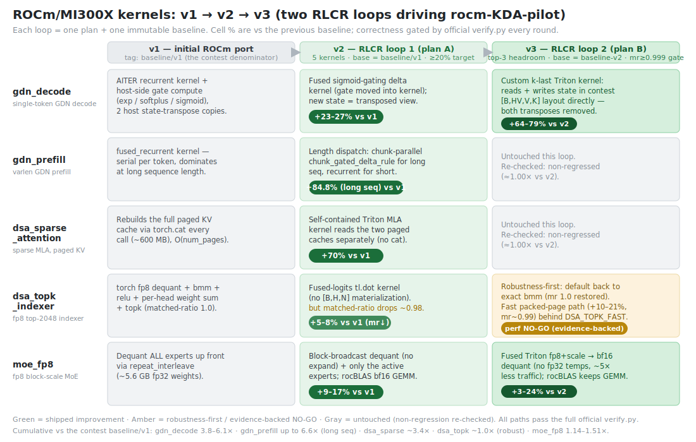

# rocm-flashinfer-contest

A **ROCm / AMD Instinct MI300X** port of the five
[MLSys 2026 FlashInfer contest](https://github.com/mit-han-lab/mlsys2026-flashinfer-contest)
kernels, optimized vs the contest's torch `reference` and locked baselines.

The contest ships kernel *definitions* (a pure-torch `reference` that is both the correctness
oracle and the speedup denominator), NVIDIA *baselines* (`flashinfer` / `deep_gemm` / CUTLASS
wrappers), and a benchmark harness (`flashinfer-bench`). This repo provides **ROCm-native
solutions** for all five kernels, written as `language=python` (AITER Triton ops or pure torch)
so they build with the portable PythonBuilder — no `nvcc`, no CUDA dependencies.

> Environment used: AMD Instinct MI300X (gfx942, CDNA3), ROCm 7.2, PyTorch 2.9.1+rocm,
> Triton 3.6 (ROCm), [AITER](https://github.com/ROCm/aiter), SGLang.

## TL;DR results (AMD MI300X)

All five kernels pass the official `verify.py` scorer on ROCm. Speedup is measured against the
**identical pure-torch reference** in each definition (`speedup = reference_ms / solution_ms`). Two
RLCR loops have run: **v2** vs the locked `baseline/v1`, then **v3** which deepened the three
highest-headroom kernels further, judged vs the immutable **`baseline-v2`** tag. The table shows the
current (v3) state.

| # | Kernel | Correctness (official `verify.py`) | speedup vs torch reference | vs `baseline/v1` (contest) | v3 gain vs `baseline-v2` |
|---|--------|:--:|--|--|--|
| 1 | `gdn_decode` | ✅ 54/54 | **48× – 3718×** † | **3.8× – 6.1×** | **+64 – 79%** (k-last, no transposes) |
| 2 | `gdn_prefill` | ✅ 100/100 | **9× – 3559×** † | **+84.8%** (long seq) | ≈0% (untouched) |
| 3 | `dsa_sparse_attention` | ✅ 23/23 | 3.4× – 12.3× | **+70%** | ≈0% (untouched) |
| 4 | `dsa_topk_indexer_fp8` | ✅ 128/128 | 2.2× – 20× | ~1.0× (mr 1.0 default) | robustness fix¹ |
| 5 | `moe_fp8_block_scale` | ✅ 19/19 (loose tol) | 1.5× – 4.5× | **1.14× – 1.51×** | **+3 to +24%** (fused dequant) |

¹ `dsa_topk_indexer` default is the exact `torch.bmm` path (per-run matched-ratio 1.0, restoring v2's
0.988–0.992). A faster packed-page kernel (`DSA_TOPK_FAST=1`) is **+10–21%** vs baseline-v2 and passes
the official 128/128, but lands at mr ~0.99, so it ships behind a flag rather than as the default.

### † Reading the speedup-vs-reference numbers (why two of them reach thousands×)

The hundreds-to-thousands× figures are **arithmetically real** but must be read correctly — they say
"how much faster than the contest's *unoptimized* torch oracle," **not** "faster than a good GPU
kernel." The contest `reference` implements the gated-delta-rule **recurrence in eager PyTorch**:
it steps token-by-token (the recurrence is serial) and, for decode, loops over the batch — launching
thousands of tiny kernels with full Python/dispatch overhead. So its cost scales ~linearly with
batch×sequence and becomes pathological at scale. Exact measured cases from
[`results/amd_mi300.md`](results/amd_mi300.md):

| case | torch `reference` | our solution | ratio |
|---|--:|--:|--:|
| `gdn_decode`, batch=1 | 1.83 ms | 0.038 ms | **48×** |
| `gdn_decode`, batch=16 | 28.2 ms | 0.033 ms | **843×** |
| `gdn_decode`, batch=64 | **110.4 ms** | 0.030 ms | **3718×** |
| `gdn_prefill`, total_seq=6 | 1.54 ms | 0.168 ms | **9×** |
| `gdn_prefill`, total_seq=8192 | **1879.9 ms** (≈1.9 s) | 0.528 ms | **3559×** |

Two things make this honest rather than a stunt: (1) at small sizes the ratio **collapses** to 9–48×,
because the reference isn't yet pathological there — the blow-up is purely the reference scaling, not
our kernel doing anything magical; (2) the number that reflects **actual kernel engineering** is *vs
the locked baselines* (already AITER-backed, reasonable implementations), where the same kernels are
**3.8–6.1× vs `baseline/v1`** / **+64–79% vs `baseline-v2`** (decode) and **up to 6.6× vs v1** on long
prefill. Those vs-baseline numbers are the defensible wins; the vs-reference column is just the
contest's official (and very forgiving) denominator.

**📋 Full write-up — content, results, and RLCR findings:**
[**`results/v3-summary.md`**](results/v3-summary.md). Raw numbers:
[`results/amd_mi300.md`](results/amd_mi300.md) (v3 candidate vs baseline-v2 and baseline/v1) ·
verdicts: [`results/v3_final-loop-report.md`](results/v3_final-loop-report.md) · full official
correctness: [`results/v3_final_verify.md`](results/v3_final_verify.md) · v2 report:
[`results/final-loop-report.md`](results/final-loop-report.md).

### Optimization methodology (RLCR)

The kernels were produced by autonomous **RLCR** (Reinforcement-Learning-from-Code-Review)
optimization loops run with the [`rocm-KDA-pilot`](https://github.com/jhinpan/rocm-KDA-pilot) skill —
a ROCm/MI300 kernel-optimization harness **inspired by [Humanize](https://github.com/PolyArch) and
the Kernel Design Agent (KDA)**. Each candidate is gated on the official `verify.py` correctness
counts (never weakened), benchmarked against an immutable baseline (v2 → `baseline/v1`; v3 →
`baseline-v2`) with HIP-event timing and full provenance, and accepted only with reproducible
evidence or closed with an evidence-backed NO-GO. v2 wins came from removing host-side waste (a
per-call full-cache `torch.cat` in `dsa_sparse_attention`, `repeat_interleave` weight dequant in
`moe_fp8`, host-side gate compute in `gdn_decode`) and a genuine algorithmic lever (chunk-parallel
prefill in `gdn_prefill`). v3 went deeper: a custom **k-last** `gdn_decode` Triton kernel that reads
and writes state in the contest layout directly (no host-side transposes, +64–79%), a fused **Triton
block-scale dequant** for `moe_fp8` that feeds rocBLAS (+3–24%), and a robustness fix for
`dsa_topk_indexer` (exact-`bmm` default restoring matched-ratio 1.0, with a faster packed-page kernel
behind `DSA_TOPK_FAST=1`).

**Reusable findings (full discussion in [`results/v3-summary.md`](results/v3-summary.md)):**
- **Profile host overhead before tuning the kernel** — the biggest wins were deleting host-side waste
  (a full-cache `torch.cat`, two state transposes, fp32 dequant temporaries), not micro-tuning.
- **A portable hand-written GEMM does not beat rocBLAS/Tensile** — the winning shape is *fused dequant
  feeding rocBLAS*, not *fused GEMM* (a fused-GEMM attempt was correct but slower; kept behind
  `MOE_USE_FUSED=1` as evidence).
- **For a layout-mismatched vendor kernel, re-implement the math in the target layout** rather than
  transposing around it (removing both boundary copies beat shaving one → the `gdn_decode` win).
- **Exact top-k gated on bit-level reference parity needs the same GEMM the reference uses** — `tl.dot`
  can't bit-match `torch.bmm`, so "fast + matched-ratio≈1.0" can be mutually exclusive; the honest
  result is an evidence-backed NO-GO plus a flagged speed option (`dsa_topk_indexer`).
- **gfx942 native fp8 is `e4m3fnuz`, not the contest's `e4m3fn`** (≈2× decode error) — keep software
  dequant; never bit-reinterpret to force a vendor fp8 path.
- **An evidence-backed NO-GO is a first-class result** — it blocks reward-hacking (no per-workload
  fitting, no warmup/input-keyed caches) and yields an honest, generalizing verdict.

The loop converged in **7 rounds (budget 12)**, exited *complete*, and its code-review reviewer
caught only substantive issues (≈zero false positives); see the methodology view in the summary.

### How the kernels evolved: v1 → v2 → v3



### Two loops, two plans — what optimized well, and the limits

Each loop is the **same harness** (`rocm-KDA-pilot`) driven by a **different plan against a different
immutable baseline**, so the two are independent and additive:

| | Plan | Baseline | Scope | Extra gates |
|---|---|---|---|---|
| **v2** (loop 1) | plan A | `baseline/v1` | all 5 kernels | ≥20% latency reduction or evidence-backed NO-GO |
| **v3** (loop 2) | plan B | `baseline-v2` (the shipped v2) | the 3 highest-headroom kernels | `>3–5%` above noise; `moe ≥20%` vs v1; `dsa_topk mr≥0.999` hard gate; no input/warmup caches; full official verify at finalize |

**What optimized well, and why.** The big wins all came from removing a *structural* cost that a
portable Triton kernel can delete without competing with the vendor GEMM:
- a per-call full-cache rebuild (`dsa_sparse`, v2 +70%),
- a serial recurrence replaced by a chunk-parallel path on long sequences (`gdn_prefill`, v2 +84.8%),
- host-side gate compute then **both** state-transpose copies (`gdn_decode`, v2 +23–27% → v3 +64–79%),
- fp32 weight-dequant traffic, cut by a fused fp8→bf16 dequant that still **feeds rocBLAS**
  (`moe_fp8`, v2 +9–17% → v3 +3–24%).

**Where it hit real limits (honest):**
- **`dsa_topk_indexer` — a genuine ceiling.** The fast packed-page kernel is +10–21% and passes the
  official gate, but a Triton `tl.dot` cannot bit-match `torch.bmm`, so at these inputs' extreme
  dynamic range it mis-ranks ~0.5–1% of boundary tokens (matched-ratio ~0.99). "Faster" and "mr≈1.0"
  are mutually exclusive here, so v3 ships the exact path by default (mr 1.0) and keeps the fast one
  behind a flag — recorded as an evidence-backed **NO-GO**, not a forced win.
- **`moe_fp8` at `seq_len=1` is only +3%** (marginal): one token is launch/routing-bound, so the
  dequant win is a smaller share — and a hand-written fused GEMM **loses to rocBLAS**, so that lever
  is a dead end (kept behind `MOE_USE_FUSED=1` purely as evidence).
- **`dsa_sparse_attention` is ~1× at the smallest shape** because the underlying AITER kernel is
  explicitly "not optimized" — the largest remaining headroom (see `docs/ROADMAP.md`).
- **The vs-reference column is inflated by a pathological reference** (above); the honest metric is
  vs-baseline, which is why both are reported side by side.

## Layout

```
solutions/<kernel>/main.py        # the ROCm solution (entry: main.py::run)
solutions/<kernel>/solution.json  # packed flashinfer-bench solution (language=python)
tools/run_benchmarks.py           # generates the per-platform results table
tools/local_verify.py             # fast, faithful local correctness/speed check
tools/pack_solution.py            # dir -> solution.json packer
patches/flashinfer_bench_timing_rocm.patch   # HIP-event timing fallback (the only harness change)
results/amd_mi300.{md,csv}        # measured AMD MI300X results
docs/GAP_REPORT.md, docs/ROADMAP.md           # full porting analysis + plan
```

## Setup (ROCm / MI300)

```bash
# 1) harness (no CUDA flashinfer needed thanks to the timing patch)
git clone https://github.com/flashinfer-ai/flashinfer-bench.git /tmp/flashinfer-bench
git -C /tmp/flashinfer-bench apply /path/to/this/patches/flashinfer_bench_timing_rocm.patch
pip install -e /tmp/flashinfer-bench --no-deps

# 2) dataset (~1.9 GB)
export FIB_DATASET_PATH=$PWD/data/flashinfer-trace
hf download flashinfer-ai/mlsys26-contest --repo-type=dataset --local-dir "$FIB_DATASET_PATH"

# 3) verify a solution (uses the official scorer)
python /tmp/flashinfer-bench/../mlsys2026-flashinfer-contest/verify.py \
    --solution solutions/gdn_decode/solution.json --fast
# ...or the fast local check:
FIB_CACHE_PATH=/tmp/fib_cache python tools/local_verify.py \
    --def gdn_decode_qk4_v8_d128_k_last --sol solutions/gdn_decode/main.py
```

## How the port works (key facts)

- **One harness patch.** `flashinfer_bench/bench/timing.py` hard-imports the CUDA-only
  `flashinfer.testing.bench_gpu_time_with_cupti`. The patch adds a `torch.cuda.Event`
  (HIP-event) fallback, so `import flashinfer_bench` works with no CUDA flashinfer. Python and
  Triton builders are fully portable; the CUDA/tvm-ffi (nvcc) builder is not — hence all
  solutions are `language=python`.
- **The torch `reference` is the baseline.** It runs unchanged on ROCm and is both the
  correctness oracle and the speedup denominator. The NVIDIA `flashinfer_wrapper_*` baselines do
  not run on ROCm and are not needed for scoring.
- **fp8 FNUZ vs OCP is sidestepped.** MI300 native fp8 is `e4m3fnuz`; the contest data is
  `e4m3fn`. Both fp8 kernels dequantize fp8→fp32/bf16 in software (the top-k evaluator even
  re-scores returned indices with a canonical dequant), so MI300's fp8 MMA dtype never enters the
  correctness path.
- **Math/layout gotchas** (captured in each `main.py`): GDN decay `g` is passed in **log space**
  and state is transposed (`[N,HV,V,K]`↔AITER `[N,HV,K,V]`); sparse-MLA layout is
  `[lora ckv | rope kpe]` with `-1` padding masked in-kernel; the top-k indexer must keep valid
  tokens whose cached data is NaN (the reference's `torch.topk` does); MoE SwiGLU gate is the
  **second** half and routing weights use the **unbiased** sigmoid.

## Caveats

- Speedups are **vs the unoptimized torch reference** (the contest denominator) and the locked
  `baseline/v1` / `baseline-v2` tags, not vs an NVIDIA kernel — the NVIDIA baseline ops are CUDA /
  SM90 / SM100 and do not run on ROCm, so no cross-vendor latency is reported here.
- `dsa_sparse_attention` is ~1× at the smallest shape because the AITER kernel is explicitly
  "not optimized" — the largest Phase-3 headroom (see `docs/ROADMAP.md`).
- `moe_fp8_block_scale` is CUDA-mandated for the NVIDIA submission; this is a portable python
  equivalent that passes the official loose tolerance (`atol=1, rtol=0.3, matched_ratio=0.9`).

## Acknowledgements

Built on [FlashInfer](https://github.com/flashinfer-ai/flashinfer),
[flashinfer-bench](https://github.com/flashinfer-ai/flashinfer-bench),
[AITER](https://github.com/ROCm/aiter), and the
[MLSys 2026 FlashInfer contest](https://github.com/mit-han-lab/mlsys2026-flashinfer-contest).
Reference/definitions © their respective authors.
